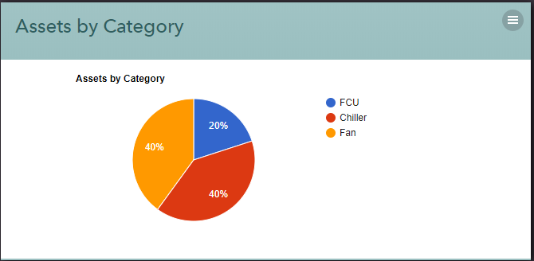

## Assets By Category

This weblet renders assets grouped by their category as pie chart that is powered by [Google Charts](https://developers.google.com/chart/interactive/docs/) library.

#### View Components

* **Weblet** - renders assets grouped by category as pie chart

  

#### Backend Components

* **SandboxBackend** - _Lucy model_ that provides data for the view to render with the following action sequences,
  * **AssetCountByCategory** - returns assets grouped by cateogry
* **Data Source**
  * **AssetCountByCategory** - returns details about a single Asset