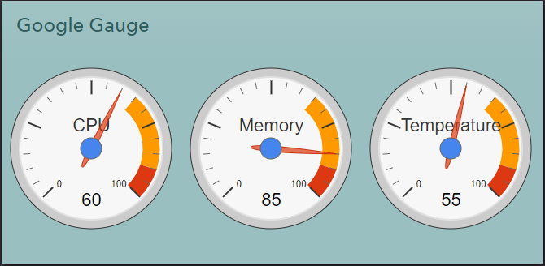

## Google Gauge

This weblet illustrates on how to create a simple google gauage that is powered by [Google Charts](https://developers.google.com/chart/interactive/docs/) library.

#### View Components

* **Weblet** - renders google gauage

  

#### Backend Components

N/A