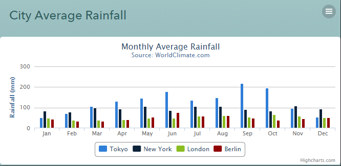
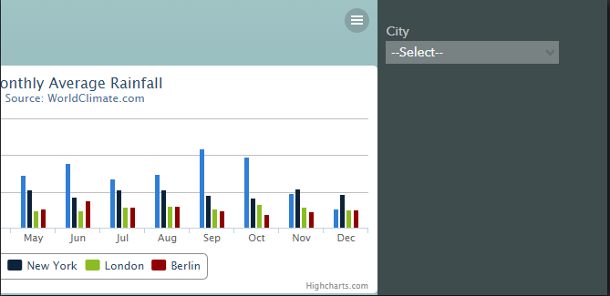
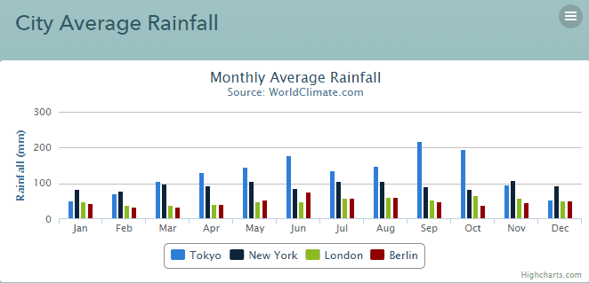

## City Average Rainfall

This weblet provides a typical use-case of plotting details in chart like bar, line or pie.

This weblet renders average monthly rainfall by cities as a bar chart that is powered by [High Charts](https://www.highcharts.com/docs/) library.

**Note:** The data is generated within the view, but Lucy can be used as a data source to make it more dynamic.

#### View Components

* **Weblet** - renders average rainfall as a bar chart

  

  

  

#### Backend Components

N/A