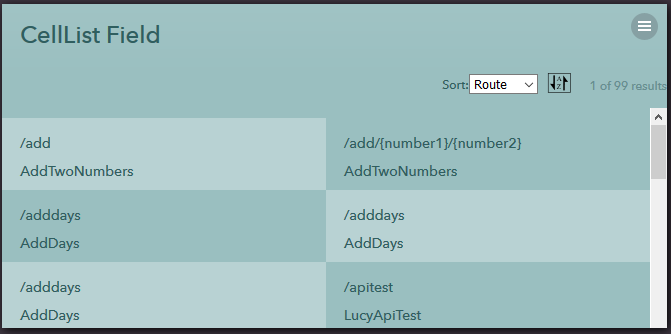
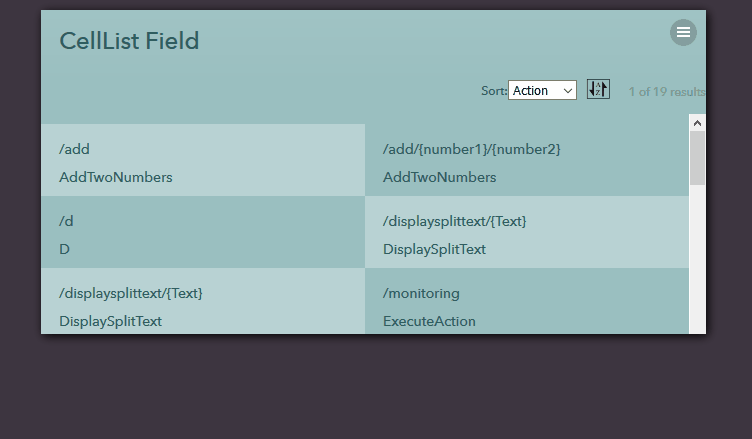

## CellList Field
This sub directory contains UI code samples for working with celllist fields.

Field that shows multiple cells from a datasource. It supports scrolling and dynamically loading more results to the bottom as you scroll. Use this for search results and lists of items in weblets. Internally, cellists are generated as an unordered list of items (ul,li). If multiple columns exist, then each column is a separate unordered list. 

**Attributes:**
  1) **cellheight** - The height of each cell in the results. If not specified, the default of '50px' is used. That should be sufficient for most cases. For weblets, use '72px' as the cell height

      **values** - px or % value
      
  2) **expandable** - Set to true to make the cell expand its height when you hover over it.

      **values** - true | false

  3) **expandedcellheight** - The height of the cell when expanded. Only applies when expandable is set to true. The _default_ is `90px`. For weblets, use `108px`.
      
      **values** - px or % value

  4) **columns** - Number of columns to render in the results. Default is `1`. If more than one column is specified, cells are rendered in left-to-right order.

      **values** - int

  5) **source** - The datasource to use for rendering cells. It should take a **last** and **max** parameter in order to make _paging_ work. This data source will be called repeatedly to pull in more results as the user scrolls. The returned data should have a column called ``__rowid__`` which uniquely identifies a row in the results and should be sequential. It should also return a column called ``__totalcount__`` which returns the total number of records available for the given filter conditions. The ``__totalcount__`` column only needs to be computed and returned when the ``__includetotalcount__`` parameter is set to 1. If ``__includetotalcount__`` is not set to 1 it is not required to return a ``__totalcount__`` column. Typically the first time a query is called, the celllist will pass ``__includetotalcount__`` as 1 and then on subsequent paging requests, it will not. When _filter conditions change_, it will re-issue the query with ``__includetotalcount__=1`` to refresh the count based on the new filters values.

      **values** - data source

  6) **max** - The maximum number of records to return each time a new set is queried.

      **values** - int

  7) **height** - The height of the entire celllist. You usually do not need to specify this

      **values** - px or % value

  8) **css** - Any extra css classes to be applied to the celllist. Commonly applied css classs include,
  
      **forweblet** - used to format and use cellist in a weblet
      
      **autoresize** - to make it change the number of columns based on the width of the celllist. Also for use primarily in weblets.

      **values** - text

  9) **async** - Set to true to make it load results only after the page finishes loading. Set to false to make it intially embed results on the page when it loads. Setting async to false is advantagous because results are immediately visible when the page loads. However if the datasource depends on filters that are being read from the page (like for search results) then you need to set async to true so that it can read the values from the page before loading data.

      **values** - true | false

  10) **include_count** - Set to true to make a total count of all available items show at the top fo the celllist. If this is true, then the datasource must accept an ``__includetotalcount__`` parameter and return a ``__totalcount__`` field as part of the results. Set this to false when using in a weblet or when calculating the total count is computationally expensive.

      **values** - true | false

  11) **nodata** - The text to be shown when there are no results.

      **values** - text

  12) **nomoredata** - The text to be shown when there are no subsequent results to show after scrolling down.

      **values** - text

  13) **hidenodata** - Set to true to prevent the _NoData_ message from being dispalyed.

      **values** - true | false

  13) **hidenomoredata** - Set to true to prevent the _NoMoreData_ message from being displayed.

      **values** - true | false

**Inner Nodes:**
  1) **Contents** -  The celllist field contains a single field that is used to specify how to render each cell of the results. For each row in the datasource result, a cell will be rendered using this field. The field can access `#{row.FieldName}` to access fields in the row being rendered. Typically you would use a `FieldBlock` as the field to render cells in a weblet.

  2) **Parameter** - A list of parameters to be passed to the datasource each time it is queried. Each parameter node must have a `name` attribute specifying the name of the parameter to pass.

      It must also have either a `value` attribute (the actual value to use - can contain a `#{...}` expression), a `field` attribute specifying which field on the page to take the value from, or a `ref` attribute specifying which field (by `ref` instead of `id`) to take the value from. When a `field` or `ref` is specified, the celllist will setup event listeners to automatically refresh the list when those form fields change their values.

#### Sample

#### Illustration

1) Filter

2) Sorting

