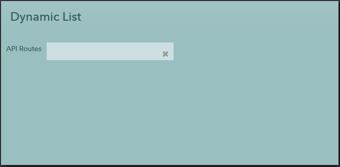
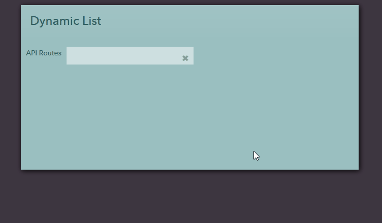

## DynamicList Field
This sub directory contains UI code samples for working with dynamiclist fields.

A field to select an item from a list. This is similar to a _list field_ except the results are _dynamically_ pulled and are _filtered_ by text as you type.

**Attributes:**
  1) **title** - A title to show near the field

      **values** - text

  2) **lucy.model** - Lucy model to retrieve the results from

      **values** - text

  3) **lucy.action** - Action to call on the Lucy model

      **values** - text

  4) **key_field** - The field from the result that should be stored as the value for the dynamic list when selected.

      **values** - text

  5) **text_field** - The field from the result that should be displayed when the list is rendered.

      **values** - text

  6) **allow_empty** - Allows the value of the field to be cleared. Default is false.

      **values** - true | false

  **Example:** If you have a dynamic list like,

  ```
    <dynamiclist id='routes' lucy.model='SandboxBackend' 
        lucy.action='AllApiRoutes' key_field='RouteKey' 
        text_field='Route'
    </dynamiclist>
  ```
  
  When Lucy action returns a result as follows, `RouteKey` will be stored when an item is chosen and `Route` is what is displayed.

  ```
  [
    {
      "Route": "/routes",
      "Method: "GET",
      "RouteKey": 1
    },
    {
      "Route": "/routes/add",
      "Method: "POST",
      "RouteKey": 2
    }
    ...
  ]
  ```

#### Sample



#### Illustration

