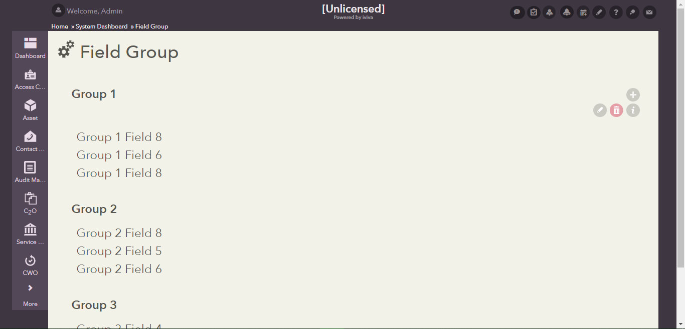

## Field Group
This sub directory contains UI code samples for working with field group.

Used to group fields together with a single title. Can supply an optional subtitle that appears on the right side. Commonly the subtitle area is used to show an 'add' button to add an item to a list of items being shown inside the group. When a page's edit icon is clicked, each field group's colorscheme can be individually customized. (An id must be assigned to the field group for it's colorscheme to be customizable).

**Attributes:**
  1) **title** - The title of the group
  
      **values** - text
  
  2) **customize_color_scheme** - Set to false to prevent the field group from having its color scheme customizable even if an id was assigned
  
      **values** - true | false
  
  3) **add.function** - Executes this javascript function when the 'add' button is clicked. It will automatically add the 'add' button to the right of the fieldgroup header. The javascript function should accept the clicked-element as it's first parameter

      **values** - text

**Inner Nodes:**
  1) **AddAction** - To handle the common use-case of showing an 'add' button. Use this and specify a UIAction block inside it. It will automatically add an 'add' icon and execute the UIAction blocks when clicked.

  2) **SubTitle** -  Html content to show as the subtitle on the right side

  3) **SubTitleFields** - instead of html content, render a list of fields on the right side

#### Sample

