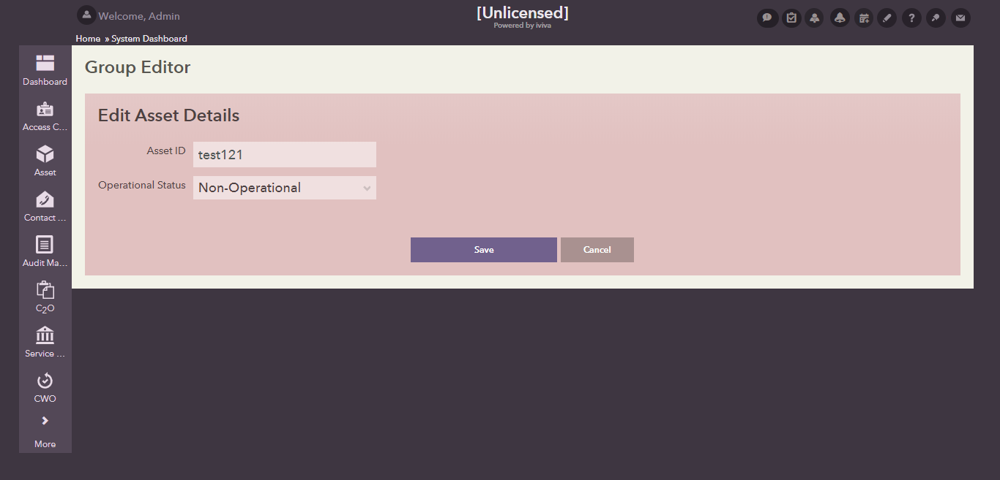
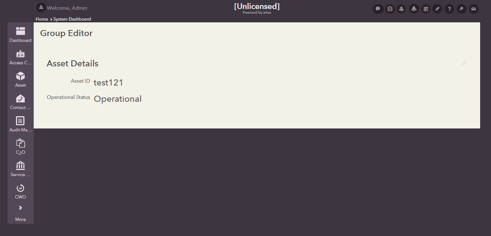

## Group Editor Field
This sub directory contains UI code samples for working with group editor fields.

 Lets you view a set of fields and then toggle them into edit mode to be edited and saved.

**Attributes:**

  1) **service** - The id of the lucy service block in the view to be executed when the edit section of the groupeditor is saved.

      **values** - lucy service block id

  2) **update_fields** - A comma separated list of other fields to be updated when this groupeditor is saved. These fields will be updated in the background after the groupeditor's edit section has been successfully saved.

      **values** - text

  3) **mode** - Determines the default mode of the groupeditor when the page is loaded. The default is `static`. Set to `edit` to cause the group editor to already be in edit mode when the page is rendered.

      **values** - edit | static

  4) **customize_color_scheme** - Set to false to prevent the group editor's static section's colorscheme from being editable. Default is `true`.

      **values** - true | false

  5) **submit** - Set to true to cause a full page submit when the edit section is saved. Otherwise it will save the contents in a background call. Default is `false`.

      **values** - true | false

  6) **save.caption** - Any alternate text to use for the save button. Keep this empty to use the system default.

      **values** - text

  7) **cancel.caption** - Any alternate text to use for the cancel  button. Keep this empty to use the system default.

      **values** - text

#### Static Mode

#### Edit Mode

#### Illustration

