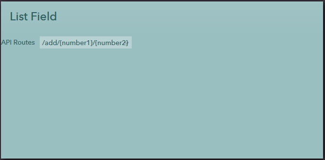

## List Field
This sub directory contains UI code samples for working with list fields.

Shows a combobox with a list of items in it. Each item should have a key and a label. The label is shown in the ui whereas the key is what is saved and used internally. When you set the value attribute of the field, you are setting the key value.

**Attributes:**
  1) **title** - A title to show near the field

      **values** - text

  2) **source** - The datasource to use to populate the list. When the source property is specified, the key_field and text_field attributes must be set.

      **values** - text

  3) **simple_source** - Lets you hard-code a simple datasource directly in the attribute itself. This is to handle cases where you want to show a simple `Yes/No` or `Operational/Non-Operational` set of options. The simple_source text should either be a comma separated list like `Operational,Non-Operational` or a _json dictionary_ of key/value pairs like `{0:"Operational",1:"Non-Operational"}`

      **values** - text

  4) **key_field** - Which field to use to obtain the `key` of each item in the list. The key is the actual piece of data that is referenced/saved. This is required when the source attribute is set. It is not required when a simple_source or model is used.

      **values** - text

  5) **text_field** - The field to use to obtain the text label to show for each option. Only required when source is set. Not required for simple_source or model sources.

      **values** - text

  6) **text_expression** - Specify a `#{...}` expression to apply to each row to derive the text label to be shown for that item. Useful where you want to calculate the label to show instead of just showing a specific field. Use the row variable to access data for each item.

      **values** - expression

  7) **value** - The actual value of this field. The currently selected item will be selected by matching the key field of the datasource with this value.

      **values** - text

  8) **unselected_text** - The text to show that indicates that no item has been selected. This will be the first item in the list and will be selected when the key value is `0` or `empty`. This defaults to `--Unselected--` but can be changed. For example, you may want to set the unselected_text to `Any`, `All` or `No` if that's what a default value of `zero/empty` represents.

      **values** - text

  9) **css** - Any css class to apply to the dropdown list.

      **values** - text

  10) **style** - Any css style rules to apply

      **values** - text

  11) **readonly** - Set this to true to make the list readonly and not changeable

      **values** - true | false

  12 **footer** - Any text to show just after the list. For example, units of measurement may be shown

      **values** - text

  **Example:** If you have a dynamic list like,

  ```
    <list id='routes' source='apiroutes' key_field='RouteKey' text_field='Route'
    </list>
    <lucy id='apiroutes' model='SandboxBackend' action='AllApiRoutes'></lucy>
  ```
  
  When Lucy action returns a result as follows, `RouteKey` will be stored when an item is chosen and `Route` is what is displayed.

  ```
  [
    {
      "Route": "/routes",
      "Method: "GET",
      "RouteKey": 1
    },
    {
      "Route": "/routes/add",
      "Method: "POST",
      "RouteKey": 2
    }
    ...
  ]
  ```

#### Sample

