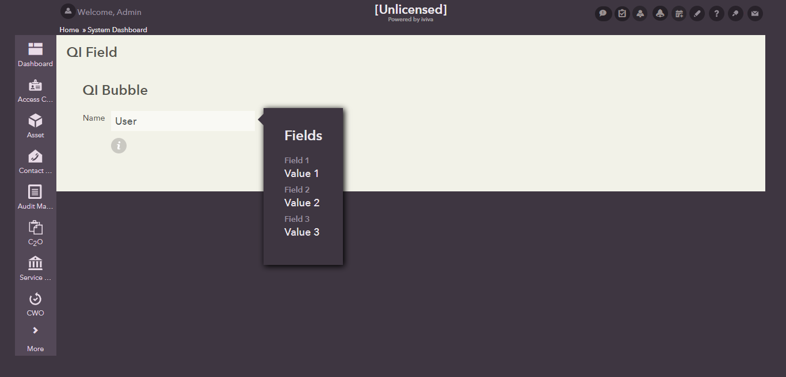

## Show Bubble UIAction
This sub directory contains UI code samples for working with qi bubble.

Takes a given field and shows it as a qi bubble near another field.

**Attributes:**

  1) **field** - The id of a field to show in the bubble (actual content to be rendered)

      **values** - text

  2) **ref** -  The ref of a field to show in the bubble (actual content to be rendered)

      **values** - text

  3) **target_field** - The id of the field near which the bubble should be shown

      **values** - text

  4) **target_ref** - The ref of the field near which the bubble should be shown

      **values** - text

#### Sample

