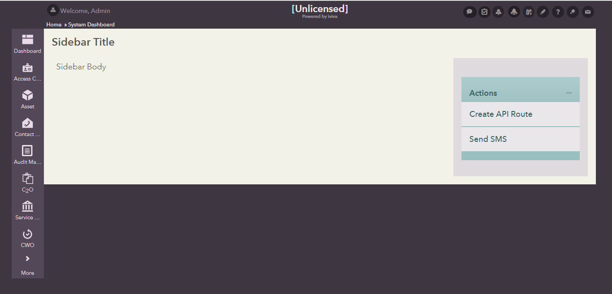
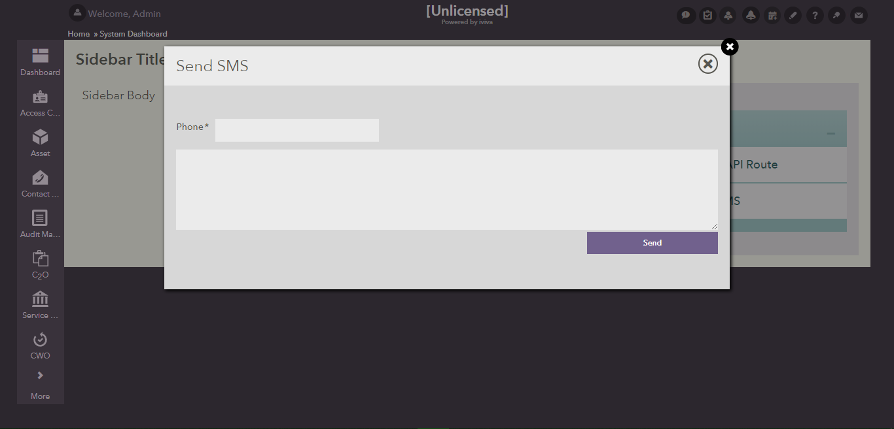

## SidebarGroup Field
This sub directory contains UI code samples for working with sidebargroup fields.

Used to group items together within a sidebar.

**Attributes:**
  1) **colorscheme** - An optional colorscheme to apply to the group

      **values** - 1-12
      
  2) **collapsed** - Set to true to make the group initially collapsed. Set to false to keep it expanded

      **values** - true | false

  3) **collapsible** - Set to true to allow the group to be collapsible.
      
      **values** - true | false
      
      **Note:** `collapsed` property should be set to `false` initially to make the sidebar group non-collapsiblee

  4) **title** - Title of the group

      **values** - text

**Inner Nodes:**
  1) **Fields** -  The sidebargroup can contain within it, any fields that need to be rendered as part of that sidebar group. Typically these would include sidebarlink fields

#### Sample

